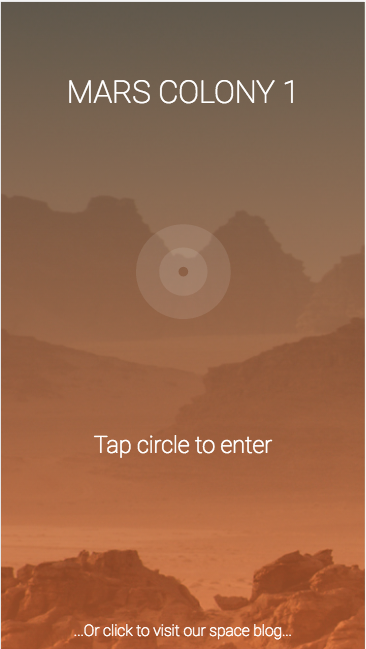

# MarsColony

Dynamically fills each page with content, gotten from an Ajax request,
in the form of JSON, using angular.
Both GET and POST were used.

# Tools used
- Angular
- TypeScript
- SASS

# Stretch Goals Implemented

- Saved the Colonist_id created from the register page, to localHost. Then use that
    same Colonist_id when reporting a new encounter.

- Created a blog page, filled from the wordpress Mars site.

# Learning Outcomes

I learned how easily angular binds the html and javascript together. It really makes
the development process simpler to figure out, compared to jquery. The syntax was
also very minimal, which was awesome.

This project helped solidify a lot of the javascript I had already learned. Coming out
of it, I feel more confident that I actually understand what I'm doing.

